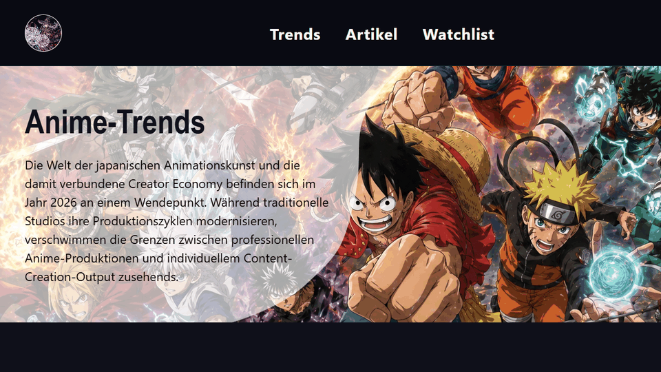

<div align="center">

# Anime Pulse

</div>

<div align="center">


</div>

<div align="center">


</div>

<div align="center">



Anime Pulse ist ein responsiver Anime-Blog mit Startseite, Trend-Bereich, Artikelseiten, Watchlist und Kontaktformular.
Das Projekt dient als Lernprojekt für saubere HTML-Struktur, modularen CSS-Aufbau, Tailwind CSS per npm/pnpm und verständliches JavaScript.

</div>

## Table Of Contents

- [Requirements](#requirements)
- [Tech Stack](#tech-stack)
- [Quickstart](#quickstart)
- [Warum node_modules nicht gepusht wird](#warum-node_modules-nicht-gepusht-wird)
- [Development](#development)
- [Project Structure](#project-structure)
- [Features](#features)
- [Learning Goals](#learning-goals)

## Requirements

Für dieses Projekt wird Node.js benötigt, weil Tailwind CSS lokal über npm/pnpm eingebunden ist.
Die installierten Pakete werden nicht direkt ins Repository gepusht, sondern über `package.json` und `pnpm-lock.yaml` beschrieben.

Empfohlen:

```text
Node.js
pnpm
VS Code mit Live Server
```

## Tech Stack

| Technology      | Purpose                                               |
| --------------- | ----------------------------------------------------- |
| HTML5           | Seitenstruktur und semantische Inhalte                |
| CSS3            | Eigene Komponenten, Layouts und responsive Anpassung  |
| Tailwind CSS v4 | Utility-Klassen und lokaler CSS-Build                 |
| JavaScript ES6+ | Navigation, FAQ-Akkordeon, Formularlogik, Validierung |
| EmailJS         | Vorbereitung für das Kontaktformular                  |

## Quickstart

1. Repository klonen:

```bash
git clone https://github.com/willidevac/anime-blog.git
```

2. Projektordner öffnen:

```bash
cd anime-blog
```

3. Abhängigkeiten installieren:

```bash
pnpm install
```

4. Tailwind CSS bauen:

```bash
pnpm run build:css
```

5. Projekt im Browser öffnen:

```text
Zum Beispiel mit Live Server in VS Code.
```

## Warum node_modules nicht gepusht wird

Der Ordner `node_modules` enthält alle installierten Pakete, die für die lokale Entwicklung benötigt werden.
Dieser Ordner kann sehr groß werden und wird deshalb nicht in Git gespeichert.

Stattdessen werden diese Dateien gepusht:

```text
package.json
pnpm-lock.yaml
```

`package.json` beschreibt, welche Pakete das Projekt braucht.
`pnpm-lock.yaml` hält die genauen Paketversionen fest, damit andere Entwickler dieselben Abhängigkeiten installieren können.

Wenn jemand das Projekt neu klont, reicht dieser Befehl:

```bash
pnpm install
```

Danach wird `node_modules` automatisch lokal neu erstellt.
Deshalb steht in der `.gitignore`:

```gitignore
node_modules/
```

Kurz gesagt:

| Datei oder Ordner | Wird gepusht? | Warum?                                      |
| ----------------- | ------------- | ------------------------------------------- |
| `package.json`    | Ja            | Enthält die Projektabhängigkeiten           |
| `pnpm-lock.yaml`  | Ja            | Speichert die exakten Paketversionen        |
| `node_modules/`   | Nein          | Wird lokal durch `pnpm install` neu erzeugt |

## Development

Während der Entwicklung kann Tailwind im Watch-Modus laufen.
Dann wird die fertige CSS-Datei bei Änderungen automatisch neu gebaut.

```bash
pnpm run watch:css
```

Für einen einmaligen Build:

```bash
pnpm run build:css
```

Die HTML-Dateien laden anschließend die generierte Datei:

```html
<link rel="stylesheet" href="css/tailwind.css" />
```

## Project Structure

```text
.
|-- .gitignore
|-- README.md
|-- index.html
|-- trends.html
|-- artikel.html
|-- artikel-frieren.html
|-- artikel-one-punch-man.html
|-- artikel-witch-hat.html
|-- watchlist.html
|-- impressum.html
|-- package.json
|-- pnpm-lock.yaml
|-- pnpm-workspace.yaml
|-- assets/
|   |-- icons/
|   `-- images/
|-- components/
|   `-- header.html
|-- css/
|   |-- tailwind-input.css
|   |-- tailwind.css
|   |-- base.css
|   |-- molecules/
|   `-- pages/
`-- js/
    `-- molecules/
        |-- contact-form.js
        `-- site-nav.js
```

## Features

| Feature                 | Description                                                 |
| ----------------------- | ----------------------------------------------------------- |
| Responsive Blog-Layout  | Seiten passen sich an Desktop, Tablet und Mobile an         |
| Modulare CSS-Struktur   | CSS ist in Basis-, Molekül- und Seiten-Dateien aufgeteilt   |
| Tailwind Build          | Tailwind wird lokal gebaut und nicht per CDN geladen        |
| Mobile Navigation       | Navigation wird per JavaScript geöffnet und geschlossen     |
| FAQ-Akkordeon           | FAQ-Bereiche können einzeln geöffnet und geschlossen werden |
| Formularvalidierung     | Kontaktformular prüft Eingaben vor dem Absenden             |
| Accessibility-Attribute | ARIA-Attribute verbessern Bedienbarkeit und Rückmeldung     |

## Learning Goals

Dieses Projekt wird Schritt für Schritt als Lernprojekt verbessert.
Wichtige Übungsbereiche sind:

- Tailwind CSS über npm/pnpm einbinden
- `node_modules` bewusst aus Git ausschließen
- saubere Projektstruktur verstehen
- verständliche Funktionskommentare schreiben
- `const` und `let` passend einsetzen
- Arrays mit Methoden wie `filter`, `forEach` und `Object.values` nutzen
- `async` und `await` in Formularlogik anwenden
- HTML, CSS und JavaScript getrennt und lesbar halten
- Barrierefreiheit mit ARIA-Attributen verbessern

## Code-Audit und offene Aufgaben

Stand: 05.07.2026

Dieser Abschnitt sammelt die aktuell gefundenen Fehler, Risiken und Modernisierungsaufgaben. Der Code wurde dabei nicht funktional angepasst.

### Gepruefte Punkte

- Git-Status geprueft: Arbeitsbaum war vor dem Audit sauber.
- Lokale `href`- und `src`-Verweise geprueft: keine fehlenden lokalen Bilder, CSS- oder JS-Dateien gefunden.
- Tailwind-Build geprueft: nach `pnpm install --frozen-lockfile` laeuft `pnpm run build:css` erfolgreich.
- HTML-Validierung mit `html-validate` ausgefuehrt: 131 Meldungen gefunden.
- Bilder, Iframes, Footer-Links, SEO-Metadaten, Navigation, Komponentenstruktur und Asset-Groessen geprueft.

### Fehler mit hoher Prioritaet

1. Footer-Link `Cookie Preferences` ist auf allen Seiten nur ein Platzhalter.
   - Betroffene Dateien: alle HTML-Seiten
   - Beispiele:
     - `index.html`
     - `trends.html`
     - `artikel.html`
     - `watchlist.html`
     - `impressum.html`
     - `artikel-frieren.html`
     - `artikel-witch-hat.html`
     - `artikel-one-punch-man.html`
   - Problem: `href="#"` oder `href=""` fuehrt zu keiner echten Cookie-Seite oder Funktion.
   - Aufgabe: Entweder Cookie-Seite/Funktion bauen oder Link entfernen.

   ### ABGESCHLOSSEN - commit "show saved cookie preference in footer dialog"

2. Ungueltiges HTML in Share-Buttons.
   - Betroffene Seiten:
     - `index.html`
     - `trends.html`
     - `artikel.html`
     - `watchlist.html`
   - Problem: In Buttons liegen blockartige Elemente wie `div` oder `p`. Der Validator meldet dadurch ungueltige Button-Inhalte.
   - Aufgabe: Button-Markup semantisch sauber umbauen, z. B. mit `span` fuer Icon und Text.

   ### ABGESCHLOSSEN - commit "use valid inline markup in share buttons"

3. Teilweise falsch verwendete ARIA-Labels.
   - Betroffene Seiten laut Validator:
     - `artikel-frieren.html`
     - `artikel-one-punch-man.html`
     - `artikel-witch-hat.html`
     - `artikel.html`
     - `index.html`
     - `trends.html`
     - `watchlist.html`
   - Problem: `aria-label` wird an Elementen genutzt, bei denen es laut Validator nicht passt.
   - Aufgabe: Pruefen, ob `aria-labelledby`, sichtbarer Text oder ein anderes semantisches Element besser passt.

   ### ABGESCHLOSSEN - commit "improve aria labels with labelled semantic regions"

4. Aktive Navigation ist inkonsistent.
   - `trends.html`, `artikel.html` und `watchlist.html` nutzen `class="is-active"`.
   - Startseite, Impressum und Artikeldetailseiten haben keine klare aktive Navigation.
   - Keine Seite nutzt `aria-current="page"`.
   - Aufgabe: Aktiven Navigationszustand einheitlich definieren und `aria-current="page"` ergaenzen.

5. Header/Footer sind stark dupliziert.
   - `components/header.html` existiert, ist aber nicht wirklich als zentrale Komponente eingebunden.
   - `components/header.html` ist ausserdem nicht auf demselben Stand wie die echten Header in den Seiten.
   - Es gibt keine `components/footer.html`, obwohl der Footer auf allen Seiten vorkommt.
   - Aufgabe: Header/Footer entweder bewusst dupliziert halten und synchronisieren oder eine echte Include-/Build-Loesung einfuehren.

### Fehler mit mittlerer Prioritaet

1. SEO-Basis fehlt fast komplett.
   - Alle Seiten haben ein `<title>`, aber keine:
     - Meta-Description
     - Canonical-URL
     - OpenGraph-Metadaten
     - Twitter/X-Card-Metadaten
     - `robots.txt`
     - `sitemap.xml`
   - Aufgabe: Pro Seite individuelle SEO-Daten ergaenzen.

2. Bilder sind nicht sauber fuer Performance vorbereitet.
   - 27 Bilder gefunden.
   - Alle Bilder haben `alt`.
   - Keine Bilder haben feste `width`- und `height`-Attribute.
   - Nur einige Iframes, aber keine Bilder nutzen `loading="lazy"`.
   - Aufgabe: Bilddimensionen ergaenzen, Lazy Loading einsetzen und responsive Bildvarianten pruefen.

3. Sehr grosse Bild- und Medienassets.
   - Beispiele:
     - `jujutsu-kaisen.jpg`: ca. 6,9 MB
     - `one-punch-man.jpg`: ca. 6,75 MB
     - `beyond-jouneys-end-season-2.jpg`: ca. 5,89 MB
     - mehrere GIF/MP4-Dateien um ca. 3,7 bis 3,9 MB
   - Aufgabe: Assets komprimieren, WebP/AVIF-Varianten erzeugen und grosse GIFs nach Moeglichkeit durch Video ersetzen.

4. Tailwind-Build erzeugt nicht exakt dieselbe `css/tailwind.css` wie aktuell committed.
   - Nach frischem Build entstehen 69 zusaetzliche Zeilen in `css/tailwind.css`.
   - Der Build laeuft zwar erfolgreich, aber die generierte Datei ist nicht deckungsgleich mit dem Repository-Stand.
   - Aufgabe: Einmal final bauen und die generierte CSS-Datei bewusst committen oder klare Build-Regel festlegen.

5. HTML-Validator meldet viele Stil- und Strukturpunkte.
   - Insgesamt: 131 Meldungen.
   - Ein grosser Teil betrifft Stilregeln:
     - `<!doctype html>` klein statt `<!DOCTYPE html>`
     - selbstschliessende Void-Elemente wie `<meta />`, `<link />`, ``, `<input />`
   - Echte Strukturpunkte:
     - rohe `&`-Zeichen muessen als `&amp;` geschrieben werden
     - ungueltige Inhalte in Buttons
     - doppelte oder unklare Landmark-Namen
     - falsche ARIA-Nutzung
   - Aufgabe: Validator-Regeln festlegen und die echten Strukturfehler zuerst beheben.

### Responsive und Layout-Aufgaben

1. Kein globales `overflow-x: hidden` gefunden.
   - Das ist gut, weil horizontale Scrollprobleme nicht global versteckt werden sollten.
   - Es gibt aber weiterhin viele lokale `overflow: hidden` an Cards, Header, Carousels und Panels.
   - Aufgabe: Pruefen, wo `overflow: hidden` wirklich zum Clippen gebraucht wird und wo Layout sauberer geloest werden kann.

2. Carousel ist HTML/CSS-basiert, aber noch pruefbeduerftig.
   - Startseiten-Carousel nutzt Radio-Inputs und Labels.
   - Karten sind klickbar und fuehren auf Artikelseiten.
   - Aufgabe: Tastaturbedienung, Fokus-Reihenfolge, mobile Darstellung und Screenreader-Verhalten nochmal gezielt testen.

3. Share-Bereich bleibt ein visueller Risikopunkt.
   - Der Share-Pfeil/Button war bereits mehrfach Thema.
   - Aufgabe: Share-Komponente als eigene, stabile Einheit definieren und auf Desktop/Mobile per Screenshot pruefen.

4. Footer-Abstaende und Positionen sollten als eigene Komponente finalisiert werden.
   - Impressum/Cookie-Links wurden bereits optisch diskutiert.
   - Aufgabe: Footer-Layout zentral festlegen und auf allen Breakpoints pruefen.

### JavaScript-Aufgaben

1. `site-nav.js` ist aktuell fuer das Burger-Menue notwendig.
   - Wenn das Burger-Menue komplett ohne JavaScript funktionieren soll, muss es auf eine Checkbox-/CSS-Loesung umgebaut werden.
   - Aufgabe: Entscheiden, ob CSS-only weiterhin Projektanforderung ist.

2. `contact-form.js` enthaelt EmailJS-Konfiguration direkt im Code.
   - Public Key ist bei EmailJS grundsaetzlich clientseitig sichtbar, trotzdem sollte der Umgang bewusst dokumentiert werden.
   - Aufgabe: Demo-/Produktionsmodus klar trennen oder Formular ohne echte Credentials als Lernprojekt markieren.

3. Formular- und Accordion-Logik sind nur auf der Startseite geladen.
   - Das ist aktuell passend, weil die Komponenten dort genutzt werden.
   - Aufgabe: Falls FAQ/Formular spaeter auf weiteren Seiten auftauchen, Script-Ladung und Initialisierung pruefen.

### Modernisierungsaufgaben

1. Tooling ergaenzen.
   - Prettier fuer einheitliche Formatierung
   - ESLint fuer JavaScript
   - Stylelint fuer CSS
   - HTML-Validator mit Projektkonfiguration
   - npm/pnpm Scripts fuer `lint`, `format`, `validate`

2. CI einrichten.
   - GitHub Actions fuer:
     - `pnpm install --frozen-lockfile`
     - `pnpm run build:css`
     - HTML-Validierung
     - optional Lighthouse/Accessibility Checks

3. Komponentenstruktur modernisieren.
   - Aktuell sind Header/Footer und viele Layoutmuster in jeder HTML-Datei wiederholt.
   - Moegliche Wege:
     - einfacher statischer Generator
     - Vite mit HTML-Partials
     - Astro/Eleventy fuer statische Seiten
   - Ziel: Wiederholung reduzieren, aber Projekt nicht unnoetig komplex machen.

4. Accessibility verbessern.
   - `aria-current="page"` fuer aktive Navigation
   - Skip-Link zum Hauptinhalt
   - Fokus-Stile ueber alle interaktiven Elemente pruefen
   - Carousel per Tastatur sauber bedienbar machen
   - reduzierte Animationen konsequent beachten

5. Performance verbessern.
   - Bilder komprimieren
   - WebP/AVIF erzeugen
   - `srcset` und `sizes` fuer wichtige Bilder
   - `width`/`height` Attribute ergaenzen
   - Lazy Loading fuer Bilder und nicht sofort sichtbare Iframes
   - grosse GIFs vermeiden oder ersetzen

6. SEO und Sharing vorbereiten.
   - Meta-Descriptions pro Seite
   - OpenGraph/Twitter Cards
   - Canonical URLs
   - `robots.txt`
   - `sitemap.xml`
   - strukturierte Daten fuer Blog/Artikel pruefen

7. Datenschutz und externe Dienste klaeren.
   - EmailJS dokumentieren
   - YouTube-NoCookie ist bereits besser als normale YouTube-Embeds, aber Cookie-Hinweis/Funktion fehlt noch.
   - Cookie Preferences Link entweder funktionsfaehig machen oder entfernen.

8. Asset-Namen vereinheitlichen.
   - Es gibt Ordner und Dateien mit Leerzeichen, Umlauten und langen Namen.
   - Aufgabe: Langfristig auf kurze, kleingeschriebene ASCII-Dateinamen umstellen, z. B. `anime-trends/witch-hat-atelier.webp`.

### Empfohlene Reihenfolge

1. Footer-Links korrigieren oder entfernen.
2. Ungueltiges Button-Markup in Share-Bereichen beheben.
3. ARIA-Fehler und aktive Navigation korrigieren.
4. Bilder optimieren und `width`/`height` plus Lazy Loading ergaenzen.
5. SEO-Grundlagen pro Seite einbauen.
6. Header/Footer als echte wiederverwendbare Struktur klaeren.
7. HTML-Validator, Prettier, ESLint und Stylelint einrichten.
8. CI mit Build- und Validierungschecks einrichten.
9. Carousel und Share-Komponente per Desktop/Mobile-Screenshots final testen.
